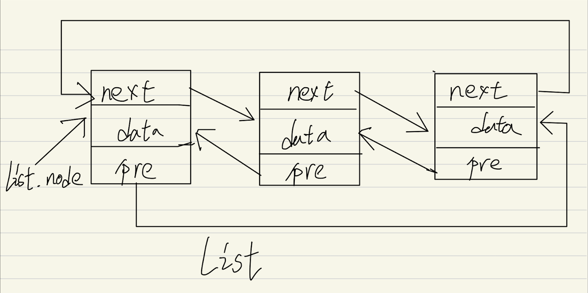

# 傻哭啦 university 学习记录

## 这是什么? 

记录一下咸鱼的日常翻滚。

## 学习进度

<details>
<summary>Week1～2: 学习编写简单的sgi stl</summary>

> 传送门: [GraVity0-stl](https://github.com/yytgravity/Daily-learning-record/tree/master/第1～2周/GraVity0_stl)

### Question 1 ： vector编写过程中的安全问题思考：
- [x] 1、 浅拷贝引起的double free：
    首先我们先看一段代码
    
```c++
#include <iostream>
#include <vector>

using std::cout; using std::endl;

class test
{
public:
    test() {cout << "调用构造函数" << endl;}
    test(const test&) {cout << "调用拷贝构造函数" << endl;}
    ~test(){cout << "调用析构函数" << endl;}
};

int main(int argc, char **argv)
{
    cout << "定义局部变量：" << endl;
    test x;
    cout << endl;

    std::vector<test> demo;
    cout << "存放在容器：" << endl;
    demo.push_back(x);
    cout << endl;

    cout << "程序结束！！！" << endl;
    return 0;
}
```


push_back代码：
```c++
        void push_back(const _Tp &__value) {
            if (_M_finish != _M_end_of_storage) {
                construct(_M_finish, __value);
                ++_M_finish;
            } else {
                _M_insert_aux(end(), __value);
            }
        }
```
没有备用空间将会调用 _M_insert_aux，该函数中包含了新空间的处理，这里因为我们是第一次push_back，并不会出现无备用空间的情况，所以暂时不做考虑。

vector的push_back在执行时，调用了一次拷贝构造函数，程序结束时调用两次析构函数，分别对应变量x和vector中的一个元素。

我们知道在没做拷贝构造函数的声明时，程序会默认调用一个浅拷贝，根据上面的例子，如果我们让他来对一个指针进行浅拷贝，在第二次析构的时候就会触发double free。

我们来看下面的一个double free 的示例：

```c++
#include <vector>
#include <unistd.h>
#include <stdio.h>
#include <string.h>
 
using namespace std;
class test
{
public:
    test() :buffer(NULL)
    {
        buffer = new char[100];
        strcpy(buffer, "12344556788");
    }
    
    /*test(const test& src)
    {
        printf("copy assign function\r\n");
    }*/
    /*
    test(const test& src)
    {
        buffer = src.buffer;
        printf("copy assign function\r\n");
    }
    */
    /*
    test(const test& src)
    {
        buffer = new char[200];
        memcpy(buffer,src.buffer,strlen(src.buffer));
        printf("copy assign function\r\n");
    }
    */
    
    ~test()
    {
        if (buffer != NULL)
            delete buffer;
        buffer = NULL;
    }
public:
    char *buffer;
};
 
void fun()
{
    test a;
    vector<test>  demo;
    demo.push_back(a);
}
 
int main(int argc, char* argv[])
{
    fun();
    printf("finish\r\n");
    getchar();
    return 0;
}

```


可以看到xcode给出了我们double free的报错。

我们可以模拟一下默认给出的拷贝构造函数：

```c++
    test(const test& src)
    {
        buffer = src.buffer;
        printf("copy assign function\r\n");
    }
```
如果去掉其中的浅拷贝，也就是像下面这样则不会触发double free。
```c++
    test(const test& src)
    {
        printf("copy assign function\r\n");
    }
```
我们将拷贝构造函数换为深拷贝：

```c++
    test(const test& src)
    {
        buffer = new char[200];
        memcpy(buffer,src.buffer,strlen(src.buffer));
        printf("copy assign function\r\n");
    }
```
也可以避免double free。

- [x] 2、de1ctf stl题目的思考：
> 传送门: [题目和exp](https://github.com/yytgravity/Daily-learning-record/tree/master/第1～2周/de1ctf-stl_container)
题目的漏洞位置： 在erase的操作过程中出现了double free

```c++
            else
            {
                auto b =  mVector->begin();
                for (int i=0;index >i;i++)
                    b++;
                mVector->erase(b);
                puts("done!");
            }
        }
```
我们先来看一下erase的底层实现：

当我们申请了两个chunk时，position1中储存了一个指向chunk1的指针，position2中存储了一个指向chunk2的指针。
在进行判断时显然position1+1并没有指向end，所以他就会调用copy将指向chunk2的指针拷贝到position1，而且copy的实现本质上是一个浅拷贝，所以我们接下来的destory就会第一次free掉chunk2。
之后第二次执行erase时，position1已经是最后一个元素，对其直接进行析构，此时chunk2就会再次被free。


- [x] 3、 erase存在的缺陷


还是上面的那段代码，这个问题说起来有点抽象，我们继续上图：

根据图我们可以很轻易的看出，我们想要删除的是 1 但是执行的却是 5 的 析构函数，我们在构造2这个对象时会通过new给他分配一个内存，但是此时再删除2时并没有调用他的析构函数（delete将内存释放），只是把它在内存空间给覆盖了
可以用一段代码来测试一下：

```c++
#include <iostream>
#include <vector>
#include <unistd.h>
#include <stdio.h>
#include <string.h>

using namespace std;

class test
{
    public:
        int i;
    public:
        test(int a)
        {
            i = a;
            cout << "construct i = " << i << endl;
        }
        test(const test &a)
        {
            i = a.i;
            cout << "copy construct i = " << i << endl;
        }
        ~test()
        {
            cout << "=== destruct i = " << i << endl;
        }
};

void show(vector<test>& num)
{
    vector<test>::iterator index;
    index = num.begin();
    while(num.end() != index)
    {
        cout << (*index).i << "  ";
        index++;
    }
    cout << endl;
}
 
int main()
{
    vector<test> num;
    for(int i = 0; i < 6; i++)
    {
        num.push_back(test(i));
    }
    
    cout << "==look here== " << endl;
 
    show(num);
    num.erase(num.begin()+1);
    show(num);
    num.erase(num.begin()+1);
    show(num);
    num.erase(num.begin()+1);
    show(num);
 
    cout << "finish" << endl;
    getchar();
    return 0;
}
```


可以看到输出中调用的析构函数和要删除的对象并不匹配。

### Question 2 ：为什么实现了uninitialized_xxx和copy/fill这样两组不同的函数：
copy/fill 是调用重载的运算符=，这就需要复制的目的地已经初始化。
uninitialized_copy/fill 是依次调用拷贝构造函数。目标区间是未初始化的，应该用uninitialized_copy/fill。

- 误用危害？：

  - 1、如果已经构造的区域，被uninitialized_xxx再次构造，在uninitialized_xxx构造之前，并不会调用之前类的析构函数，可能存在潜在的泄漏（比如复制构造函数的主体抛出，会出现内存泄漏？）
 - 2、fill错误使用：这个就可能性很多了（未定义）。
 
### Question 3 ：绘制每个容器在内存里的对象存储图




### Question 4 ：测试题目
传送门: [小测试](https://github.com/yytgravity/Daily-learning-record/tree/master/第1～2周/小测验)

### Question 5 ：学习一下师傅们的漏洞思路：
1.sad师傅：

```
	1.vector容器在增加元素个数的时候，会根据剩余空间考虑是不是要重新分配一块内存来存储。
	而误用的流程就是：在fooA函数中获取容器的一个元素，之后调用fooB函数，在fooB函数中又调用了pushback等增加元素的操作触发了vector的resize,这时候返回fooA函数再使用之前获取的元素就是已经被析构的了。
	这个误用不仅仅会出现在vector中，所有增删操作会让容器重新分配的内存的都会出现。
	经测试asan会显示uaf
	https://paste.ubuntu.com/p/SCtjVMCxxk/
	2.vector的assign操作如果assign的newsize比原有size小，则会将后面多余的元素全部析构。而在遍历容器元素又错误调用了assign之后再使用已经被释放的元素就会造成uaf
	经测试asan会显示uaf
	poc中遍历原大小为10的vector在遍历第五个元素时调用assign将size变为3，此时再使用当前遍历到的第五个元素就会uaf
	https://paste.ubuntu.com/p/hnP9QVk7JK/
	3.为容器erase添加一层新封装的时候如果没有判断删除pos的值会导致删除不存在的元素。
	如下poc，为erase添加新封装remove后没有判断pos的值不能为负数，则用户可以调用remove删除不存在的元素。
	#include <vector>
	using namespace std;
	void remove(int pos, vector<int> vec) {
 	   	vec.erase(vec.begin() + pos);
	}
	int main() {
  	  	vector<int> lll;
  	  	lll.push_back(1);
   	 	remove(-1, lll);
   		return 0;
	}
```
2.pkfxxx师傅:

```
    发现在vector容器的insert和emplace这个两个函数中，在pos位置就地构造元素时，都是直接使用赋值=，如果类型T使用的是默认的赋值构造函数且含有指针类型，
则在参数元素被析构之后，vector容器中还会保留一份副本，会导致UAF。
poc： https://paste.ubuntu.com/p/SHBDQm8G7B/
在linux用asan测试可得到UAF的log
解决办法就是给容器里的类型重载赋值运算符，除此之外，对于有指针类型的类，一定要定义其拷贝构造函数以及对赋值运算符重载，不然很容易出类似的问题。
```
3.f00l师傅：

- vector 

​	pop_back后end迭代器会前向移动一个单位，但是这里它并没有检查移动后的end是否超前于begin，这样如果多次对vector pop，那么end就会超出本vector的范围，那么就会发生越界读写。asan编译后抛出 heap overflow的警告

- list

​	是erase的锅，如果在你疯狂对list进行erase，在它为空的时候，里面会有一个head node，由于list是双向循环链表，这时head node就会指向它自己，此刻在进行erase，就会对head node进行析构，然后释放对应内存，但是list里的erase函数会返回一个指向erase的结点的后继结点的迭代器，这样我们会拿到一个指向已释放内存的指针，会造成uaf。asan编译后会抛use after free的警告。

poc //我把两个写在一起了
```c++
#include <iostream>
#include "stl_alloc.h"
#include "stl_iterator.h"
#include "stl_vector.h"
#include "stl_list.h"
#include "stl_pair.h"
#include "stl_hashtable.h"
#include <vector>
#include<list>
int main() {
    f00l_stl::vector<int>v1(2,10);
    f00l_stl::vector<int>v2(1,10);
    f00l_stl::vector<int>v3(3,10);
    v2.pop_back();
    v2.pop_back();
    v2.pop_back();
    v2.pop_back();
    v2.push_back(0xdeadbeef); //在这里可以把deadbeef写到v1里,越界读写
    //int a1 = v1.at((size_t)&v2/4+1);
    f00l_stl::list<int>l;  
    auto iterator  = l.begin();
    bool a = v1.empty();
    auto m = l.erase(iterator); //在这里会返回一个已经释放的迭代器
    if(a)
        std::cout<<"good"<<std::endl;
    else
        std::cout<<v1[1]<<std::endl;
    //std::cout << "Hello, World!" << std::endl;
    return 0;
}
```

</details>

<details>
<summary>Week2.5～3:（番外）学习hongfuzz</summary>
笔记有点乱，之后整理一下再放上来。

</details>


<details>
<summary>Week3～4: 学习编写简单的内核</summary>

> 第一章笔记+代码: [第一章](https://github.com/yytgravity/Daily-learning-record/tree/master/第3～4周/第1章)

> 第二章笔记+代码: [第二章](https://github.com/yytgravity/Daily-learning-record/tree/master/第3～4周/第2章)

> 第三章笔记+代码: [第三章](https://github.com/yytgravity/Daily-learning-record/tree/master/第3～4周/第3章)

> 第四章笔记+代码: [第四章](https://github.com/yytgravity/Daily-learning-record/tree/master/第3～4周/第4章) 

> 第五章笔记+代码: [第五章](https://github.com/yytgravity/Daily-learning-record/tree/master/第3～4周/第5章)

> 第六章笔记+代码: [第六章](https://github.com/yytgravity/Daily-learning-record/tree/master/第3～4周/第6章)

> 第七章笔记+代码: [第七章](https://github.com/yytgravity/Daily-learning-record/tree/master/第3～4周/第7章) 

参考的书籍 《操作系统真象还原》


</details>