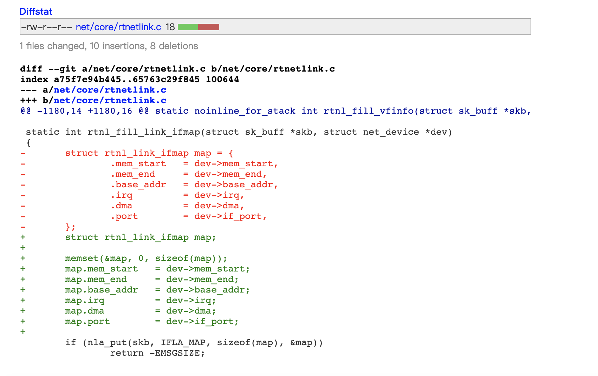

## Linux Kernel 4.4 - 'rtnetlink' Stack Memory Disclosure

#### 漏洞pattern
rtnl_fill_link_ifmap函数中没有对结构体初始化，该结构体大小为28字节，之后会因为编译器的对齐，而使四字节的内核信息泄漏。
#### 漏洞原理分析
这个漏洞的成因主要有两点：1、没有为结构体初始化 2、编译器的字节对齐。

我们先来简单介绍一下编译器的字节对齐：
下面是编译器实现字节对齐的三个准则：
- 1) 结构体变量的首地址能够被其最宽基本类型成员的大小所整除；

- 2) 结构体每个成员相对结构体首地址的偏移量(offset)都是成员大小的整数倍，如有需要编译器会在成员之间加上填充字节(internal adding)；

- 3) 结构体的总大小为结构体最宽基本类型成员大小的整数倍，如有需要编译器会在最末一个成员之后加上填充字节{trailing padding}。

我们来定位到他的漏洞函数（位于net/core/rtnetlink.c）：

```
static int rtnl_fill_link_ifmap(struct sk_buff *skb, struct net_device *dev)
{
	struct rtnl_link_ifmap map = {
		.mem_start   = dev->mem_start,
		.mem_end     = dev->mem_end,
		.base_addr   = dev->base_addr,
		.irq         = dev->irq,
		.dma         = dev->dma,
		.port        = dev->if_port,
	};
	if (nla_put(skb, IFLA_MAP, sizeof(map), &map))
		return -EMSGSIZE;

	return 0;
}
```
在该函数中首次没有为rtnl_link_ifmap map结构体初始化，这使得该结构题被分配的地址可能存在信息残余。

其次该结构体的大小为28字节，并不是16字节的整数倍，这里编译器会将其对其为32字节，之后再通过nla_put函数讲结构体输出出来，这样就会导致出现四字节的泄漏。

我们在nla_put函数处下一个断点，可以看到他此时的参数，rdx存放的是他的第三个参数，为结构体大小，可以看到此时大小为0x20，rcx寄存器存储的是他的第四个参数，为结构体的内存地址，我们接下来去查看一下该地址


可以看到在结构体最后8字节中，他的后四字节为未初始化残留下来的内核地址，在之后的输出中，这部分内容就会被泄漏。


#### 补丁信息

可以看到在之后的修复补丁中，增加了memset函数，来将结构体要分配的地址做了一个初始化，将内容全部清零，也就避免了信息的泄漏。