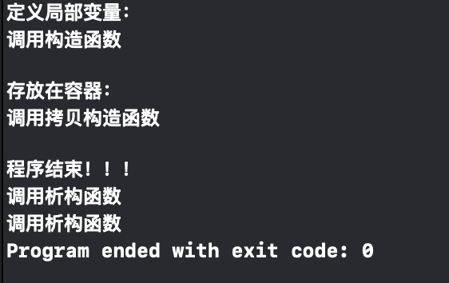
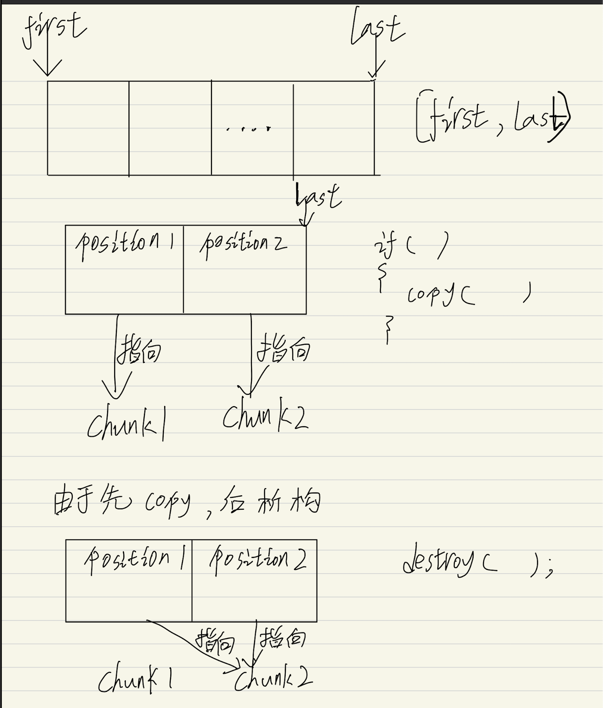
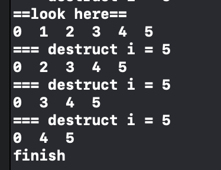

- [x] 1、 浅拷贝引起的double free：
    首先我们先看一段代码
    
```c++
#include <iostream>
#include <vector>

using std::cout; using std::endl;

class test
{
public:
    test() {cout << "调用构造函数" << endl;}
    test(const test&) {cout << "调用拷贝构造函数" << endl;}
    ~test(){cout << "调用析构函数" << endl;}
};

int main(int argc, char **argv)
{
    cout << "定义局部变量：" << endl;
    test x;
    cout << endl;

    std::vector<test> demo;
    cout << "存放在容器：" << endl;
    demo.push_back(x);
    cout << endl;

    cout << "程序结束！！！" << endl;
    return 0;
}
```


push_back代码：
```c++
        void push_back(const _Tp &__value) {
            if (_M_finish != _M_end_of_storage) {
                construct(_M_finish, __value);
                ++_M_finish;
            } else {
                _M_insert_aux(end(), __value);
            }
        }
```
没有备用空间将会调用 _M_insert_aux，该函数中包含了新空间的处理，这里因为我们是第一次push_back，并不会出现无备用空间的情况，所以暂时不做考虑。

vector的push_back在执行时，调用了一次拷贝构造函数，程序结束时调用两次析构函数，分别对应变量x和vector中的一个元素。

我们知道在没做拷贝构造函数的声明时，程序会默认调用一个浅拷贝，根据上面的例子，如果我们让他来对一个指针进行浅拷贝，在第二次析构的时候就会触发double free。

我们来看下面的一个double free 的示例：

```c++
#include <vector>
#include <unistd.h>
#include <stdio.h>
#include <string.h>
 
using namespace std;
class test
{
public:
    test() :buffer(NULL)
    {
        buffer = new char[100];
        strcpy(buffer, "12344556788");
    }
    
    /*test(const test& src)
    {
        printf("copy assign function\r\n");
    }*/
    /*
    test(const test& src)
    {
        buffer = src.buffer;
        printf("copy assign function\r\n");
    }
    */
    /*
    test(const test& src)
    {
        buffer = new char[200];
        memcpy(buffer,src.buffer,strlen(src.buffer));
        printf("copy assign function\r\n");
    }
    */
    
    ~test()
    {
        if (buffer != NULL)
            delete buffer;
        buffer = NULL;
    }
public:
    char *buffer;
};
 
void fun()
{
    test a;
    vector<test>  demo;
    demo.push_back(a);
}
 
int main(int argc, char* argv[])
{
    fun();
    printf("finish\r\n");
    getchar();
    return 0;
}

```


可以看到xcode给出了我们double free的报错。

我们可以模拟一下默认给出的拷贝构造函数：

```c++
    test(const test& src)
    {
        buffer = src.buffer;
        printf("copy assign function\r\n");
    }
```
如果去掉其中的浅拷贝，也就是像下面这样则不会触发double free。
```c++
    test(const test& src)
    {
        printf("copy assign function\r\n");
    }
```
我们将拷贝构造函数换为深拷贝：

```c++
    test(const test& src)
    {
        buffer = new char[200];
        memcpy(buffer,src.buffer,strlen(src.buffer));
        printf("copy assign function\r\n");
    }
```
也可以避免double free。

- [x] 2、de1ctf stl题目的思考：
> 传送门: [题目和exp](https://github.com/yytgravity/Daily-learning-record/tree/master/第1～2周/de1ctf-stl_container)
题目的漏洞位置： 在erase的操作过程中出现了double free

```c++
            else
            {
                auto b =  mVector->begin();
                for (int i=0;index >i;i++)
                    b++;
                mVector->erase(b);
                puts("done!");
            }
        }
```
我们先来看一下erase的底层实现：

当我们申请了两个chunk时，position1中储存了一个指向chunk1的指针，position2中存储了一个指向chunk2的指针。
在进行判断时显然position1+1并没有指向end，所以他就会调用copy将指向chunk2的指针拷贝到position1，而且copy的实现本质上是一个浅拷贝，所以我们接下来的destory就会第一次free掉chunk2。
之后第二次执行erase时，position1已经是最后一个元素，对其直接进行析构，此时chunk2就会再次被free。



- [x] 3、 erase存在的缺陷


还是上面的那段代码，这个问题说起来有点抽象，我们继续上图：

根据图我们可以很轻易的看出，我们想要删除的是 1 但是执行的却是 5 的 析构函数，我们在构造2这个对象时会通过new给他分配一个内存，但是此时再删除2时并没有调用他的析构函数（delete将内存释放），只是把它在内存空间给覆盖了
可以用一段代码来测试一下：

```c++
#include <iostream>
#include <vector>
#include <unistd.h>
#include <stdio.h>
#include <string.h>

using namespace std;

class test
{
    public:
        int i;
    public:
        test(int a)
        {
            i = a;
            cout << "construct i = " << i << endl;
        }
        test(const test &a)
        {
            i = a.i;
            cout << "copy construct i = " << i << endl;
        }
        ~test()
        {
            cout << "=== destruct i = " << i << endl;
        }
};

void show(vector<test>& num)
{
    vector<test>::iterator index;
    index = num.begin();
    while(num.end() != index)
    {
        cout << (*index).i << "  ";
        index++;
    }
    cout << endl;
}
 
int main()
{
    vector<test> num;
    for(int i = 0; i < 6; i++)
    {
        num.push_back(test(i));
    }
    
    cout << "==look here== " << endl;
 
    show(num);
    num.erase(num.begin()+1);
    show(num);
    num.erase(num.begin()+1);
    show(num);
    num.erase(num.begin()+1);
    show(num);
 
    cout << "finish" << endl;
    getchar();
    return 0;
}
```


可以看到输出中调用的析构函数和要删除的对象并不匹配。
