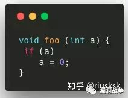
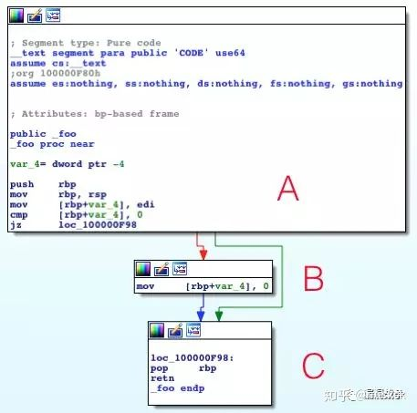
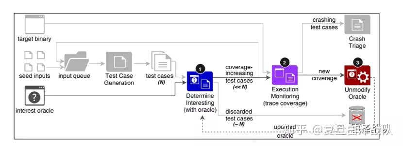

#honggfuzz基础和Full-speed Fuzzing

这篇文章主要记录了结合projectzero的Fuzzing ImageIO来学习Full-speed Fuzzing

Full-speed Fuzzing的论文：传送门: [Full-speed Fuzzing](https://arxiv.org/abs/1812.11875?context=cs.CR)

- 本文发表在IEEE Symposium on Security and Privacy 2019，作者是来自弗吉尼亚理工学院的研究团队。

### honggfuzz基础学习
- 此部分主要为后面的论文学习做铺垫。（参考泉哥的博文）
-  计算代码覆盖率的三个单位：
 - 1、函数（Fuction-Level）： 就是代码执行时调用到哪些函数，但是函数里面的具体代码行却不作统计，相对比较粗糙但高效的统计方式。
 - 2、基本块（BasicBlock-Level）：通常的统计方式是用基本块，简称BB。IDA中每一块代码就代表着一个基本块，就是以指令跳转为作划分界限的。
 - 3、边界（Edge-Level）：edge本身就涵盖了基本块部分，唯一的差别是edge多记录了一些执行边界的信息。
   示例：
        
        
        通过ida可以很直观的看到，此时出现了条件判断，如果a为假将会直接执行到c，如果我们采用基本块的方式，就无法确切的知道是否曾经从a执行到c。这时候就引出了边界。
        
        
    如上图edge会在A跟C之间建立虚拟块D，通过判断D是否执行过，来确认是否曾从A执行到C。

    
### Full-speed Fuzzing
#### 技术简介
- 目前由覆盖引导的模糊测试技术会追踪所有测试用例的代码覆盖率，然而绝大部分的测试用例和他们的覆盖信息实际是无用的，因为他们并不会增加代码覆盖率。追踪这些无用的测试用例极大的增加了模糊测试工具的开销。
- 为了减少对这些无用测例的追踪以提高模糊测试的性能，有人提出了一种由覆盖引导的追踪技术，来对过滤这些无用测例。该技术可以在不对测例进行追踪的情况下，检测出一个新生成的测例会不会引起代码覆盖率的增加，只有当新测例会引起代码覆盖率增加，才对该测例进行覆盖追踪，以获得完整的覆盖率信息。

#### 设计思路

- 上图是引入了由覆盖引导的追踪技术后，模糊测试工具的流程图。在原有代码覆盖追踪（标号2）之前引入了一个新的步骤 the interest oracle（标号1）。Interest Oracle的基本原理是，对于待模糊测试的目标二进制程序，在每一个未覆盖的基本块的开始处插入一个特殊的中断指令，生成一个新的程序。对于每一个新生成的测试用例，先在新的程序上运行，如果触发了该特殊的中断指令，说明这个测例到达了一个之前未到达过的基本块，因此这个测例会引起覆盖率的增加，是一个我们感兴趣的测例；如果没有触发中断，则说明这个输入到达的都是之前已经测试过的基本块，会被直接抛弃。只有当一个新的测例被确定是感兴趣的测例，才会被传递给后续模块进行真正的代码覆盖追踪（标号2）。代码覆盖追踪可以确定这个测例所到达的所有之前未到达的基本块，新程序中这些块头部的中断指令就会被移除（标号3）。

- 由覆盖引导的追踪技术使用了一个轻量的技术方案，来确定一个测例是否会到达新的基本块，增加代码覆盖率，避免对无效的测例进行覆盖追踪，从而提升整体的性能。

#### 实战部分
- 传送门: [fuzzing imageio](https://googleprojectzero.blogspot.com/2020/04/fuzzing-imageio.html)

###### 思路分析
上文提到Full-speed Fuzzing的第一步为：在每一个未覆盖的基本块的开始处插入一个特殊的中断指令，生成一个新的程序。所以我们就需要获取基本块的偏移。

<details>
<summary>通过简单的IDAPython脚本完成枚举库中每个基本块的起始偏移量。</summary>
```
import idautils
import idaapi
import ida_nalt
import idc


from os.path import expanduser
home = expanduser("~")

patchpoints = set()

max_offset = 0
for seg_ea in idautils.Segments():
    name = idc.get_segm_name(seg_ea)
    if name != "__text":
        continue

    start = idc.get_segm_start(seg_ea)
    end = idc.get_segm_end(seg_ea)
    for func_ea in idautils.Functions(start, end):
        f = idaapi.get_func(func_ea)
        if not f:
            continue
        for block in idaapi.FlowChart(f):
            if start <= block.start_ea < end:
                max_offset = max(max_offset, block.start_ea)
                patchpoints.add(block.start_ea)
            else:
                print("Warning, broken CFG?")

# Round up max_offset to page size
size = max_offset
rem = size % 0x1000
if rem != 0:
    size += 0x1000 - rem

with open(home + "/Desktop/patches.txt", "w") as f:
    f.write(ida_nalt.get_root_filename() + ':' + hex(size) + '\n')
    f.write('\n'.join(map(hex, sorted(patchpoints))))
    f.write('\n')

print("Done, found {} patchpoints".format(len(patchpoints)))
```
[运行结果](/img/trapfuzz.patches)
</details>

接下来是基于Full-speed Fuzzing的fuzz方法的实现
<details>
<summary>trap fuzz方法的实现。</summary>
首先根据trapfuzz.patches中的library name，也就是imageio，获取的到库基地址
- 从dyld获取所有加载模块的列表，task_info()将获得给定任务的dyld的all_image_info结构体的地址，从中我们可以获得所有模块的名称和加载地址

```
#include <mach-o/dyld_images.h>
static void* find_library_load_address(const char* library_name) {
  kern_return_t err;

  task_dyld_info_data_t task_dyld_info;
  mach_msg_type_number_t count = TASK_DYLD_INFO_COUNT;
  err = task_info(mach_task_self(), TASK_DYLD_INFO, (task_info_t)&task_dyld_info, &count);

  const struct dyld_all_image_infos* all_image_infos = (const struct dyld_all_image_infos*)task_dyld_info.all_image_info_addr;
  const struct dyld_image_info* image_infos = all_image_infos->infoArray;

  for(size_t i = 0; i < all_image_infos->infoArrayCount; i++){
    const char* image_name = image_infos[i].imageFilePath;
    mach_vm_address_t image_load_address = (mach_vm_address_t)image_infos[i].imageLoadAddress;
    if (strstr(image_name, library_name)){
      return (void*)image_load_address;
    }
  }
  return NULL;
}
```
接下来我们来创建shadow memory，在shadow memory中，我们需要为每个patch存储4字节（3字节位图索引，1字节原始值）,操作如下：
```
    uint32_t* shadow = SHADOW(lib_base + offset);
    uint8_t orig_byte = lib_base[offset];
    *shadow = (bitmap_index << 8) | orig_byte;
```
下面是创建shadow memory的代码：
```
#define SHADOW(addr) ((uint32_t*)(((uintptr_t)addr & 0xfffffffffffffffc) - 0x200000000000 - ((uintptr_t)addr & 0x3)*0x10000000000))

void initializeTrapfuzz() {

        ............
   
       while ((nread = getline(&line, &len, patches)) != -1) {
        char* end = line + len;
        
        char* col = strchr(line, ':');

        if (col) {
            *col = 0;
            lib_base = find_library_load_address(line);
            if (!lib_base) {
                LOG_F("Library %s does not appear to be loaded", line);
            }

            lib_size = strtoul(col + 1, &end, 16);
            if (lib_size % 0x1000 != 0) {
                LOG_F("Invalid library size 0x%zx. Must be multiple of 0x1000", lib_size);
            }

            // Make library code writable.
            if (mprotect(lib_base, lib_size, PROT_READ | PROT_WRITE | PROT_EXEC) != 0) {
                LOG_F("Failed to mprotect library %s writable", line);
            }

            // Create shadow memory.
            for (int i = 0; i < 4; i++) {
                void* shadow_addr = SHADOW(lib_base + i);
                void* shadow = mmap(shadow_addr, lib_size, PROT_READ | PROT_WRITE, MAP_PRIVATE | MAP_ANON | MAP_FIXED, 0, 0);
                if (shadow == MAP_FAILED) {
                    LOG_F("Failed to mmap shadow memory");
                }
            }
            // Done, continue with next line.
            continue;
        }
        
        ............
        
```
下面在进行fuzzing的进程用断点指令（Intel上的int3）替换每个未发现的基本块的首字节，并且将位图索引以及原始值存储在shadow memory中
```
void initializeTrapfuzz() {
        
        ............
     
        // It's an offset, parse it and do the patching.
        unsigned long offset = strtoul(line, &end, 16);
        if (offset > lib_size) {
            LOG_F("Invalid offset: 0x%lx. Current library is 0x%zx bytes large", offset, lib_size);
        }

        bitmap_index++;

        if (bitmap_index >= (int)_HF_PC_GUARD_MAX) {
            LOG_F("Too many basic blocks to instrument");
        }

        uint32_t* shadow = SHADOW(lib_base + offset);
        if (*shadow != 0) {
            LOG_F("Potentially duplicate patch entry: 0x%lx", offset);
        }

        if (ATOMIC_GET(feedback->pcGuardMap[bitmap_index])) {
            continue;
        }

        // 在shadow memory中创建查找条目。
        uint8_t orig_byte = lib_base[offset];
        *shadow = (bitmap_index << 8) | orig_byte;
        // 用int3替换指令，int3是一种仪器陷阱。
        lib_base[offset] = 0xcc;
    }
    // Store number of basic blocks for statistical purposes.
    if ((int)ATOMIC_GET(feedback->guardNb) < bitmap_index + 1) {
        ATOMIC_SET(feedback->guardNb, bitmap_index + 1);
    }

    free(line);
    fclose(patches);
```
通过sigaction(SIGTRAP, &s, 0);安装一个SIGTRAP处理程序，他在捕获到SIGTRAP信号时，调用我们设置好的信号处理函数：sigtrap_handler。
```
    // Install signal handler for SIGTRAP.
    struct sigaction s;
    s.sa_flags = SA_SIGINFO;        
    s.sa_sigaction = sigtrap_handler;
    sigemptyset(&s.sa_mask);
    sigaction(SIGTRAP, &s, 0);
}
```
sigtrap_handler的代码实现：
功能：
- 检索故障地址并计算库中的偏移量以及shadow memory中相应条目的地址
- 将基本块标记为在全局覆盖位图中找到
- 用原始字节替换断点
- 恢复执行
```
static void sigtrap_handler(int signum, siginfo_t* si, void* context) {
    // Must re-execute the instruction, so decrement PC by one instruction.
#if defined(__APPLE__) && defined(__LP64__)
    ucontext_t* ctx = (ucontext_t*)context;
    ctx->uc_mcontext->__ss.__rip -= 1;
#else
#error "Unsupported platform"
#endif

    uint8_t* faultaddr = (uint8_t*)si->si_addr - 1;
    // If the trap didn't come from our instrumentation, then we probably will just segfault here
    uint32_t shadow = *SHADOW(faultaddr);

    uint8_t orig_byte = shadow & 0xff;
    uint32_t index = shadow >> 8;

    // Index zero is invalid so that it is still possible to catch actual trap instructions in instrumented libraries.
    if (index == 0) {
        abort();
    }
    // Restore original instruction
    *faultaddr = orig_byte;

    // Update coverage information.
    bool prev = ATOMIC_XCHG(feedback->pcGuardMap[index], true);
    if (prev == false) {
        ATOMIC_PRE_INC_RELAXED(feedback->pidFeedbackEdge[my_thread_no]);
    }
}
```

</details>


